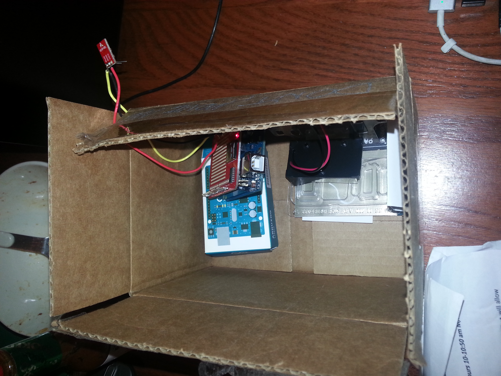

# Name
Alexander Tsankov

# Hardware Photo

# Data type
Data is being saved to a CSV file. 

# How did you get your prototype working?
I added an extra part to the print statement in the file to record actual seconds. I compiled the code into the arduino, put it in a box with the microphone hanging out and left it on my kitchen table between 22:35 9/10/14 and 11:47 9/13/14.

# Arduino Code
modified_sound_sensor_p1.ino

# Data Sample
data.csv

# How did you collect this data?
I put the arduino sensor in a box on my kitchen table and let it record over a period of time. I simply saved the data as a csv and performed subsequent analysis.

# What signal do you think is in your data?
I plan on examining this data to see if there are any trends between the time when my roommates get back to the house and volume levels in our living room. 

# How fun was this mini-project? 
8

# How hard was it? 
5

# How much did you learn from the experience?
9
